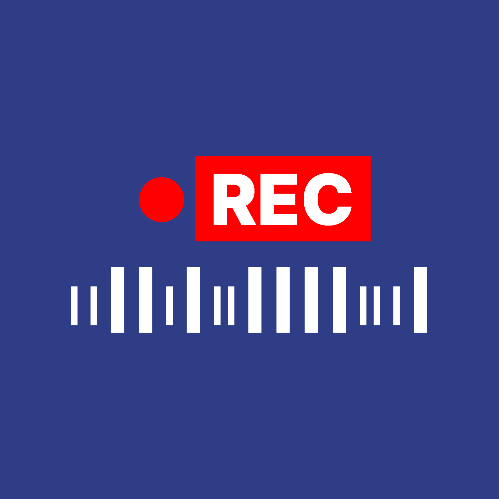
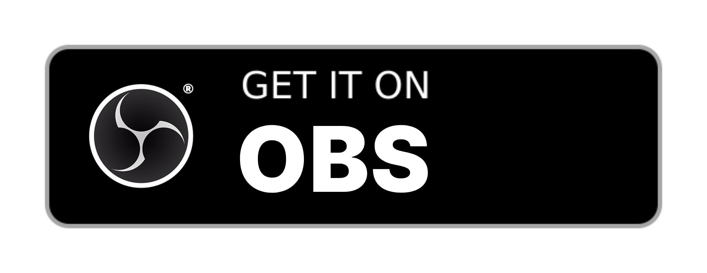

  

<h1 align="center">Recording Indicator</h1>
<h3 align="center">Made For Your OBS Studio<a href="#installation"></h3>

 

 

---

## How it works
When the 'Start recording' button is pressed, a popup window appears on top of the screen showing you that OBS is recording. 
You can drag the window to reposition the popup.

*This script was made using Python and the tkinter library with ❤️*

## Features
- Custom sticks-to-edges popup implemented.
- Preference settings for showing timers & status texts.
- Pause and unpause using right-click menu.
- Always on top.
- Hide Indicator in Captured Video (Windows Only)

---

## Guides

### Requirements
- Python 3
- Additional requirements needed by platforms are written [here](https://docs.obsproject.com/scripting).

### Installation
1. In OBS, go to **Tools > Scripts**.
2. Click the **+** button and add the downloaded `obs_recording_indicator.py` file from [GitHub Release](../../releases/latest).
> Make sure PATH is set in OBS's Python Setting Tab.
3. Save & exit Tools.
4. Done! :)

---

## LICENSE & CopyRights

The original codes & libraries were written & made by [@tobsailbot](https://github.com/tobsailbot). 
Some major fixes & improvements were made here, but this repo may be merged after some reviews from the original repo contributors & authors.
