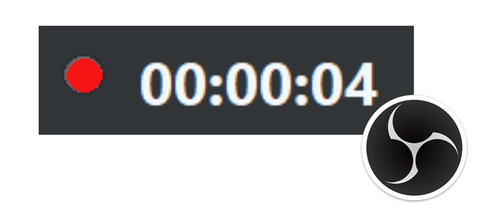

# Recording Indicator For OBS Studio
> **Recording Indicator For Your OBS Studio**

--- 

## How it works
When the 'Start recording' button is pressed, a popup window appears on top of the screen showing you that OBS is recording. 
You can drag the window to reposition the popup.

*This script was made using Python and the tkinter library with ❤️*

## Features
- Custom sticks-to-edges popup implemented.
- Preference settings for showing timers & status texts.
- Pause and unpause using right-click menu.
- Always on top.

---

## Guides

### Requirements
- Python 3
- Additional requirements needed by platforms are written [here](https://docs.obsproject.com/scripting).

### Installation
1. In OBS, go to **Tools > Scripts**.
2. Click the **+** button and add the downloaded `OBS_RecordingHelper.py` file from [GitHub Release](./releases/latest).

> Make sure PATH is set in OBS's Python Setting Tab.

> [!IMPORTANT]  
> 3. Save & exit OBS and restart OBS.

> [!NOTE]  
> Without restarting OBS, the script may not work well.

---

## LICENSE & COPYRIGHTS

The original codes & libraries were written & made by [@tobsailbot](https://github.com/tobsailbot). 
Some major fixes & improvements were made here, but this repo may be merged after some reviews from the original repo contributors & authors.
